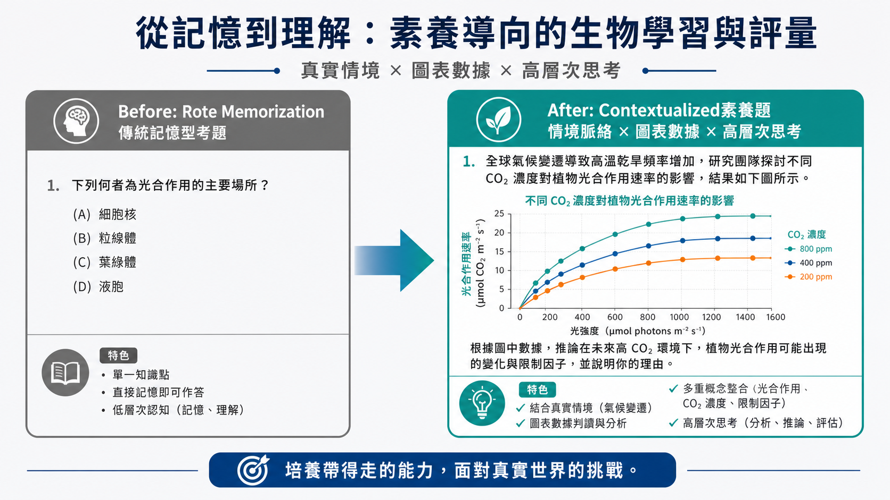
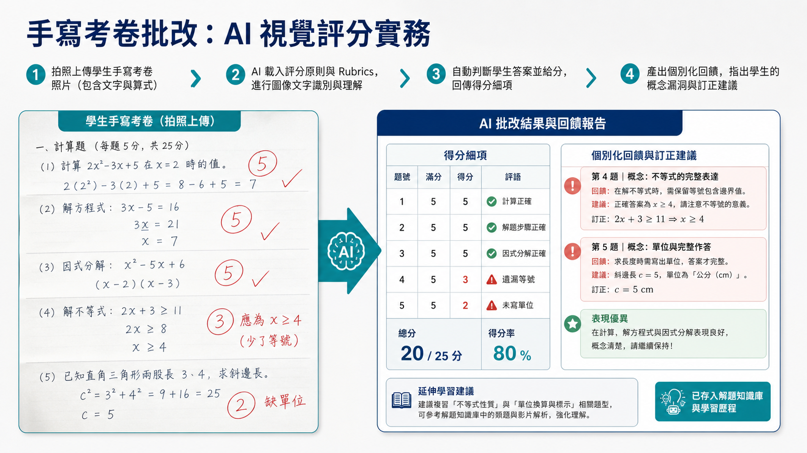
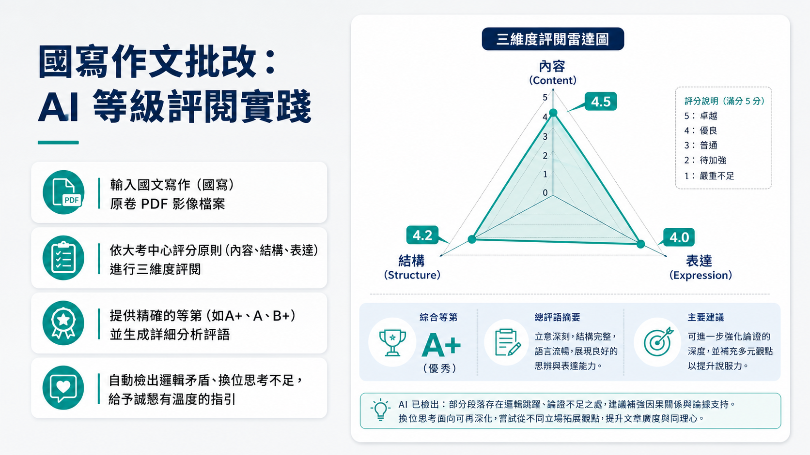
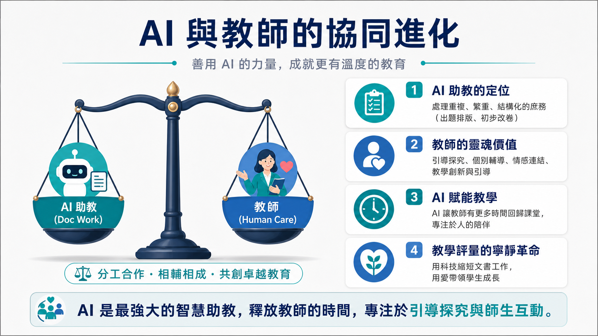

# AI助教時代的教學評量革命：出題、改題與解題的智慧工作流

本專案是專為高中與國中教師設計的智慧教學評量工作流研習課程資源。結合大型語言模型與多模態 AI 技術，幫助教師擺脫繁重的命題與批改文書負擔，回顧教學初心，專注於引導探究與師生互動。

## 🏫 研習講師與主辦
- **講師**：臺北市立麗山高中 **林獻升 老師**
- **協力**：**LM 工作室**

---

## 🎯 研習四大核心模組

1. **模組一：評量變革學理基礎**
   - 108課綱下的「評量深淵」痛點解析。
   - 素養導向評量與大考趨勢（會考「三多一沒有」、學測「混合題型」、分科測驗「鷹架式題組」）。
   - 對齊布魯姆認知層次的命題難度配置。

2. **模組二：AI 輔助出題實務**
   - 互動出題工具（Kahoot! AI, Quizizz AI）。
   - 智慧診斷回饋（Edcafe AI）與個人化學習回饋。
   - 提示詞黃金結構（角色、任務、格式、限制）。
   - 影音出題（YouTube逐字稿）、實驗命題、多模態視覺出題（圖表、構造圖）。
   - 各大 AI 命題模型（ChatGPT, Claude, Gemini, Perplexity）能力評比與誘答選項設計。

3. **模組三：AI 輔助改題與智慧批改**
   - 傳統題目改造Before/After實踐（以「菌根共生」題目為例）。
   - 階段式 Rubrics（評分規準）設計與 AI 等級評閱實務。
   - 實體手寫考卷、國寫作文的 AI 視覺批改流程。
   - 師生評量智慧助手（Gradescope）應用。

4. **模組四：AI 輔助解題與自動化代理**
   - 一鍵生成考卷詳解與班級複習指引。
   - 大考趨勢深度分析（115學測自然科案例）。
   - 利用 NotebookLM 建立班級專屬 24 小時解題 AI 助教。
   - 客製化命題 Bot（GPTs 與 Gemini Gem）設定。
   - AI Agent 自動化一鍵生成完整試卷與排版成果展示。

---

## 📦 成果資源下載

- 📊 **研習簡報下載**：[下載 AI輔助考卷出改解題研習.pptx](AI輔助考卷出改解題研習.pptx) (包含 32 頁完整投影片與詳細講稿)
- 📝 **完整演講稿與備註**：[檢視 speech.md](speech.md) (內含逐頁說法與教學引導重點)
- 📌 **簡報規劃大綱**：[檢視 outline.md](outline.md)
- ⚙️ **簡報設定檔**：[檢視 deck_spec.json](deck_spec.json)

---

## 🖼️ 簡報精彩預覽 (精選頁面)

以下是研習簡報中清爽專業風 (A風格：淺灰背景、深藍結構、亮青強調) 的實物渲染成果：

### 1. 研習封面 (Slide 01)

### 2. 傳統題目素養改造 Before & After (Slide 18)

### 3. AI 視覺批改實務 (Slide 21)

### 4. 國寫作文評閱 (Slide 22)

### 5. AI 與教師的協同進化總結 (Slide 30)

---

## 🛠️ 開發與建置說明

本簡報採用 Google DeepMind 團隊設計的 `codex-ppt` 工具鏈與 `DALL-E 3 / Imagen` 視覺模型一鍵式生成。
所有 32 張幻燈片皆是 16:9 高解析度圖像，並藉由 python 腳本自動組裝為 PowerPoint 檔，同時完美注入每一頁的中文講者備註，實現高效率、高品質的教材開發工作流。
